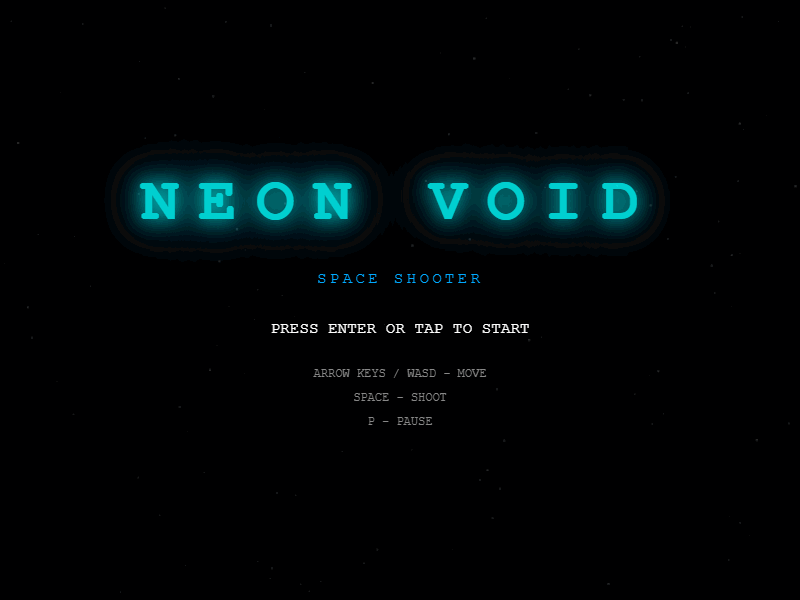
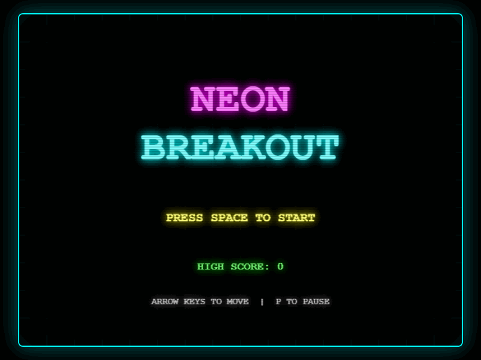
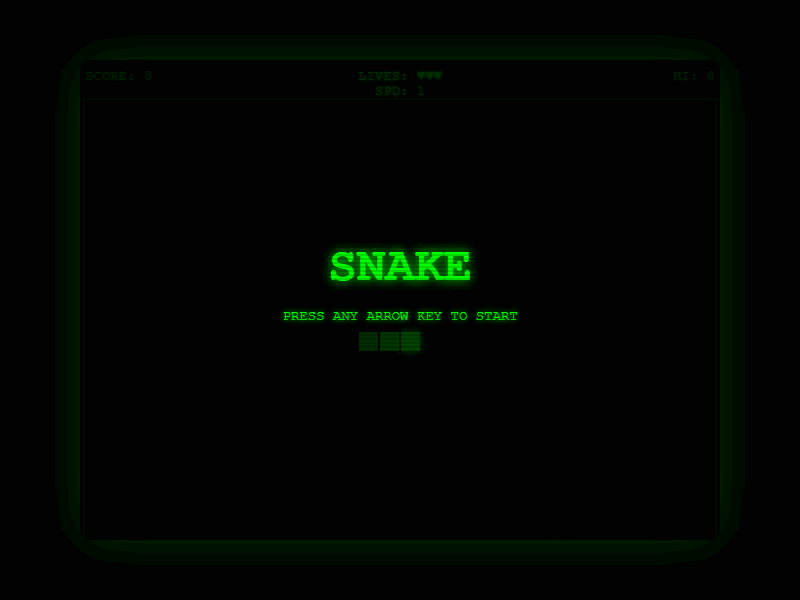
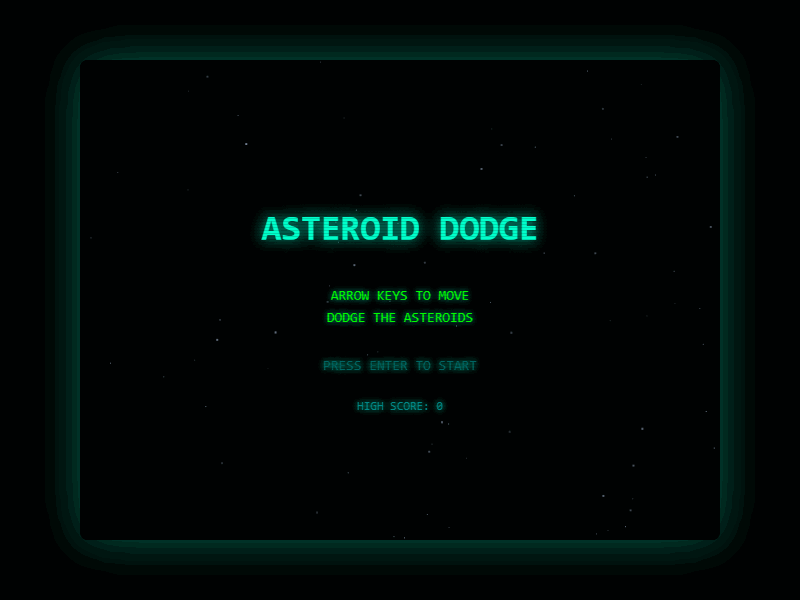
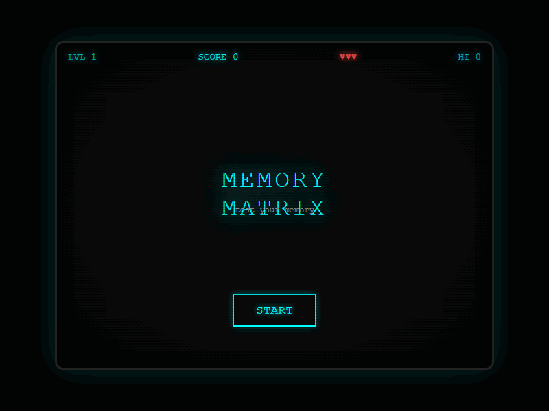
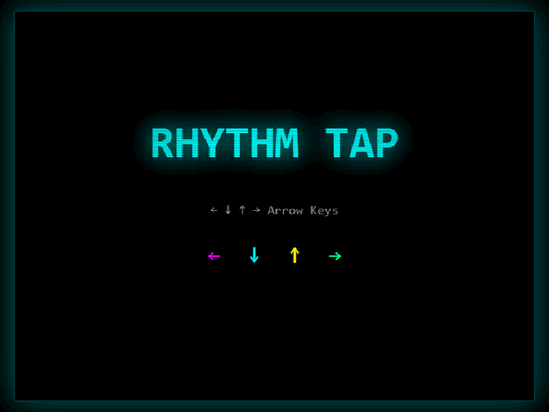
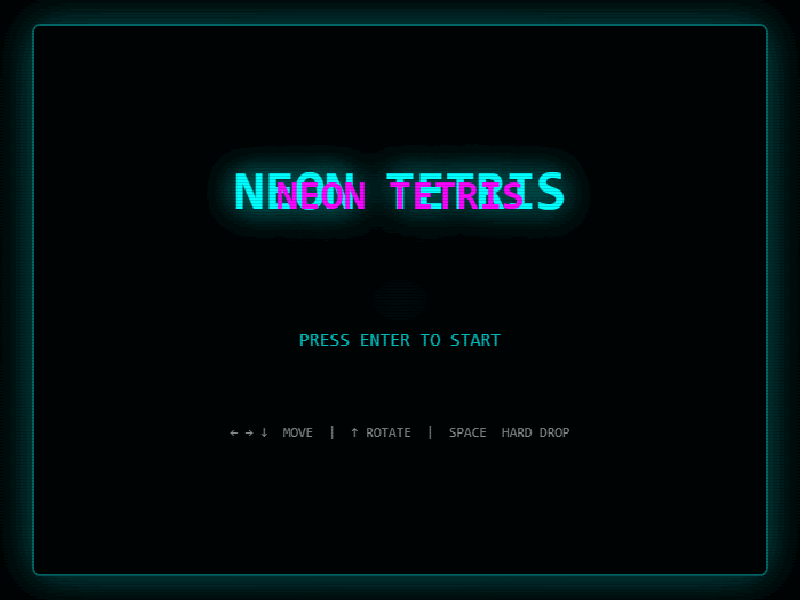
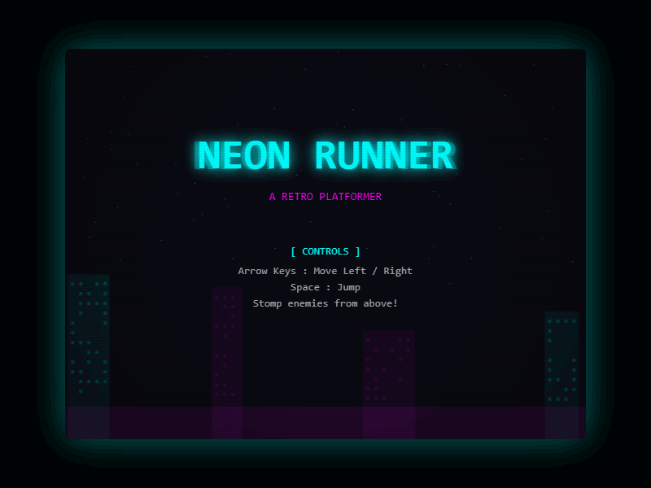
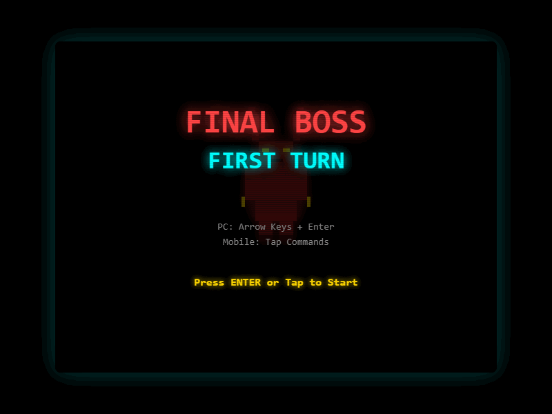
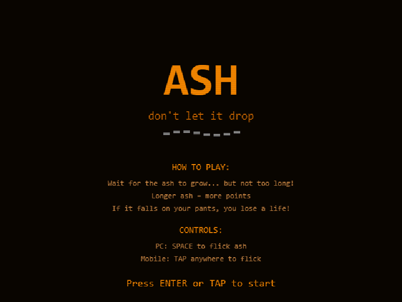

```
  ___  _  _ ___   ___ ___  ___  __  __ ___ _____
 / _ \| \| | __| | _ \ _ \/ _ \|  \/  | _ \_   _|
| (_) | .` | _|  |  _/   / (_) | |\/| |  _/ | |
 \___/|_|\_|___| |_| |_|_\\___/|_|  |_|_|   |_|

  ___ _   __  __ ___ ___
 / __| |_|  \/  | __/ __|
| (_ | ' \ |\/| | _|\__ \
 \___|_||_|_|  |_|___|___/
```

> 1 prompt. 1 game. no second chances.

**no edits. 1 prompt each.**

every game in this repo was built from a single prompt fed to [Claude Code](https://claude.ai/code). no edits. no follow-ups. no "actually, can you also..." — whatever comes out ships as-is.

**all games are playable in your browser right now** → [play them here](https://shumatsumonobu.github.io/one-prompt-games/)

## the rules

```
> write one prompt.
> feed it to claude code.
> ship whatever comes out.
> touch the code and you're disqualified.
```

that's it. the prompt is the only weapon you get.

## games

<table>
<tr>
<td align="center" valign="top" width="33%">
<h3>space-shooter</h3>
<em>blast through waves of enemies in neon space. survive the boss. chase the high score.</em>
<br><br>
<a href="https://shumatsumonobu.github.io/one-prompt-games/space-shooter/"></a>
<br>
<a href="https://shumatsumonobu.github.io/one-prompt-games/space-shooter/">▶ Play</a>
<br><br>
<strong>the prompt:</strong>
<p>Build a single-file browser game (HTML/CSS/JS). A retro space shooter with neon-on-black aesthetic, CRT scanlines, and screen glow. Scrolling starfield background. Player ship is a glowing cyan triangle. Arrow keys to move, space to shoot. Enemy waves: straight-line drones, zigzag fighters, V-formation bombers. Power-ups drop from destroyed enemies: spread shot, shield, speed boost. Boss fight after wave 3 with health bar. Score counter, 3 lives, high score saved to localStorage. 8-bit sound effects via Web Audio API. Fullscreen responsive canvas. No external dependencies.</p>
</td>
<td align="center" valign="top" width="33%">
<h3>breakout</h3>
<em>smash neon bricks with a glowing paddle. catch power-ups. clear all 3 levels.</em>
<br><br>
<a href="https://shumatsumonobu.github.io/one-prompt-games/breakout/"></a>
<br>
<a href="https://shumatsumonobu.github.io/one-prompt-games/breakout/">▶ Play</a>
<br><br>
<strong>the prompt:</strong>
<p>Build a single-file browser game (HTML/CSS/JS). A retro breakout/brick-breaker with neon-on-black aesthetic, CRT scanlines, and screen glow. Neon-colored bricks in rows, glowing paddle at bottom, bright ball with trail effect. Arrow keys to move paddle. Power-ups drop from broken bricks: wide paddle, multi-ball, fireball that pierces through bricks. 3 levels with increasing brick layouts. Score counter, 3 lives, high score saved to localStorage. 8-bit sound effects via Web Audio API. Fixed 4:3 canvas, centered on screen. No external dependencies.</p>
</td>
<td align="center" valign="top" width="33%">
<h3>snake</h3>
<em>eat, grow, don't hit yourself. classic snake with bonus food and speed levels.</em>
<br><br>
<a href="https://shumatsumonobu.github.io/one-prompt-games/snake/"></a>
<br>
<a href="https://shumatsumonobu.github.io/one-prompt-games/snake/">▶ Play</a>
<br><br>
<strong>the prompt:</strong>
<p>Build a single-file browser game (HTML/CSS/JS). A retro snake game with green-on-black terminal aesthetic, CRT scanlines, and screen glow. Arrow keys to move. Snake is bright green segments on a dark grid. Normal food glows green, bonus food appears randomly in gold for extra points and fades after 5 seconds. Snake speeds up every 5 food eaten. Speed level display on screen. Wall collision and self-collision mean death. Score counter, high score saved to localStorage. 8-bit sound effects via Web Audio API. Fixed 4:3 canvas, centered on screen. No external dependencies.</p>
</td>
</tr>
<tr>
<td align="center" valign="top" width="33%">
<h3>asteroid-dodge</h3>
<em>no weapons. just reflexes. dodge falling asteroids as long as you can.</em>
<br><br>
<a href="https://shumatsumonobu.github.io/one-prompt-games/asteroid-dodge/"></a>
<br>
<a href="https://shumatsumonobu.github.io/one-prompt-games/asteroid-dodge/">▶ Play</a>
<br><br>
<strong>the prompt:</strong>
<p>Build a single-file browser game (HTML/CSS/JS). A retro asteroid dodger with neon-on-black aesthetic, CRT scanlines, and screen glow. Ship at bottom, asteroids fall from top in random sizes and speeds. Arrow keys to move, no shooting — pure dodge. Speed increases over time. Near-miss bonus points when asteroids pass close. Particle explosion when hit. Score counter based on survival time, 3 lives, high score saved to localStorage. 8-bit sound effects via Web Audio API. Fixed 4:3 canvas, centered on screen. No external dependencies.</p>
</td>
<td align="center" valign="top" width="33%">
<h3>memory-matrix</h3>
<em>watch the pattern. tap from memory. grids get bigger. your confidence doesn't.</em>
<br><br>
<a href="https://shumatsumonobu.github.io/one-prompt-games/memory-matrix/"></a>
<br>
<a href="https://shumatsumonobu.github.io/one-prompt-games/memory-matrix/">▶ Play</a>
<br><br>
<strong>the prompt:</strong>
<p>Build a single-file browser game (HTML/CSS/JS). A retro memory matrix game with cyan-on-black terminal aesthetic, CRT scanlines, and screen glow. Grid of cells that flash a pattern, player must click cells from memory. Starts 3x3 with 3 cells lit, grows to 4x4 then 5x5 with more cells each level. Pattern shows for 2 seconds then hides. Wrong click = lose a life, correct sequence = next round. Score counter, 3 lives, high score saved to localStorage. 8-bit sound effects via Web Audio API. Fixed 4:3 canvas, centered on screen. START button on title screen. No external dependencies.</p>
</td>
<td align="center" valign="top" width="33%">
<h3>rhythm-tap</h3>
<em>notes fall. arrows flash. hit the beat or lose it all.</em>
<br><br>
<a href="https://shumatsumonobu.github.io/one-prompt-games/rhythm-tap/"></a>
<br>
<a href="https://shumatsumonobu.github.io/one-prompt-games/rhythm-tap/">▶ Play</a>
<br><br>
<strong>the prompt:</strong>
<p>Build a single-file browser game (HTML/CSS/JS). A retro rhythm tap game with neon-on-black aesthetic, CRT scanlines, and screen glow. 4 lanes with falling notes, each mapped to arrow keys (Left/Down/Up/Right). Notes fall from top to hit zone at bottom. Only one note falls at a time, never simultaneous notes in multiple lanes. Perfect/Good/Miss judgement with visual feedback. Combo counter and multiplier. Patterns are auto-generated and loop. Speed increases every 30 seconds. Glowing hit effects and particle bursts on perfect hits. Score counter, 3 lives (miss = lose life), high score saved to localStorage. 8-bit sound effects via Web Audio API. Fixed 4:3 canvas, centered on screen. Title screen with game name, press Enter to start. No external dependencies.</p>
</td>
</tr>
<tr>
<td align="center" valign="top" width="33%">
<h3>tetris</h3>
<em>stack blocks. clear lines. lose a life when you top out. classic falling-piece puzzle.</em>
<br><br>
<a href="https://shumatsumonobu.github.io/one-prompt-games/tetris/"></a>
<br>
<a href="https://shumatsumonobu.github.io/one-prompt-games/tetris/">▶ Play</a>
<br><br>
<strong>the prompt:</strong>
<p>Build a single-file browser game (HTML/CSS/JS). A retro Tetris clone with neon-on-black aesthetic, CRT scanlines, and screen glow. Classic 10x20 grid. 7 standard tetrominoes (I, O, T, S, Z, J, L) in distinct neon colors. Arrow keys to move left/right/down, Up to rotate, Space for hard drop. Ghost piece showing where the block will land. Next piece preview. Line clear animation with flash effect. Scoring: 1 line = 100, 2 = 300, 3 = 500, 4 (Tetris) = 800, multiplied by level. Speed increases every 10 lines cleared. 3 lives — topping out costs a life and partially clears the board to continue. Game over when all lives are lost. Score counter, level display, lines cleared counter, high score saved to localStorage. 8-bit sound effects via Web Audio API. Fixed 4:3 canvas, centered on screen. Title screen with game name, press Enter to start. No external dependencies.</p>
</td>
<td align="center" valign="top" width="33%">
<h3>platformer</h3>
<em>run, jump, stomp. neon city scrolls by as you chase coins and dodge enemies.</em>
<br><br>
<a href="https://shumatsumonobu.github.io/one-prompt-games/platformer/"></a>
<br>
<a href="https://shumatsumonobu.github.io/one-prompt-games/platformer/">▶ Play</a>
<br><br>
<strong>the prompt:</strong>
<p>Build a single-file browser game (HTML/CSS/JS). A retro side-scrolling platformer with neon-on-black aesthetic, CRT scanlines, and screen glow. Player is a glowing cyan character that runs and jumps through procedurally generated levels. Arrow keys to move left/right, Space to jump. Scrolling camera follows the player. Platforms at varying heights with gaps to jump across — gaps never wider than the player's max jump distance so all layouts are beatable. Enemies patrol platforms and can be stomped from above for points, but touching them from the side costs a life. Collectible coins floating above platforms for bonus score. Speed gradually increases as the player progresses. Parallax scrolling background with distant neon city silhouette. Particle effects on jump, stomp, and coin pickup. Score counter, 3 lives, high score saved to localStorage. 8-bit sound effects via Web Audio API. Fixed 4:3 canvas, centered on screen. Title screen with game name, control instructions (Arrow keys: move, Space: jump, stomp enemies from above), and press Enter to start. No external dependencies.</p>
</td>
<td align="center" valign="top" width="33%">
<h3>final-boss</h3>
<em>no story. no leveling. just you vs the Demon King. survive all 3 phases.</em>
<br><br>
<a href="https://shumatsumonobu.github.io/one-prompt-games/final-boss/"></a>
<br>
<a href="https://shumatsumonobu.github.io/one-prompt-games/final-boss/">▶ Play</a>
<br><br>
<strong>the prompt:</strong>
<p>Build a single-file browser game (HTML/CSS/JS). A retro RPG boss battle with neon-on-black aesthetic, CRT scanlines, and screen glow. The game starts immediately with the final boss fight — no story, no leveling, just you vs the Demon King. Turn-based combat system. Hero has 4 commands: Attack, Magic, Defend, Heal. Attack deals random physical damage. Magic costs MP and deals heavy elemental damage. Defend halves incoming damage for one turn. Heal costs MP and restores HP. Hero starts with 999 HP and 200 MP. The Demon King has 3 phases: Phase 1 (full HP) uses single attacks, Phase 2 (below 60% HP) adds devastating multi-hit combos with charge-up warning, Phase 3 (below 30% HP) adds instant-kill moves that can only be survived by Defending. Boss telegraphs dangerous moves one turn before with glowing text warning. Every 5 turns a random bonus event occurs: MP restore, critical boost, or boss stagger that skips the boss turn. Pixel-art style characters drawn on canvas — hero is a glowing cyan knight on the right, Demon King is a large crimson horned figure with glowing eyes on the left. Damage numbers float up with animation. Screen shakes on heavy hits. Victory screen shows total damage dealt, turns taken, and rating (S/A/B/C). 3 lives — defeat costs a life and restarts the current phase with hero fully restored, but boss HP carries over. Game over when all lives lost. Score based on turns taken and lives remaining, high score saved to localStorage. PC controls: arrow keys to select command, Enter to confirm. Mobile: 4 large touch buttons at the bottom of the screen for each command, responsive layout. 8-bit sound effects via Web Audio API. Fixed 4:3 canvas, centered on screen. Title screen with game name "FINAL BOSS: FIRST TURN", control instructions (PC: Arrow keys + Enter / Mobile: Tap commands), and press Enter or tap to start. No external dependencies.</p>
</td>
</tr>
<tr>
<td align="center" valign="top" width="33%">
<h3>ash</h3>
<em>flick the ash before it drops. wait too long and it lands on your pants.</em>
<br><br>
<a href="https://shumatsumonobu.github.io/one-prompt-games/ash/"></a>
<br>
<a href="https://shumatsumonobu.github.io/one-prompt-games/ash/">▶ Play</a>
<br><br>
<strong>the prompt:</strong>
<p>Build a single-file browser game (HTML/CSS/JS). A retro cigarette ash chicken-race game with warm orange-on-black aesthetic, CRT scanlines, and screen glow. A pixel-art character sits on a bench smoking — side view, relaxed pose. The cigarette in their mouth slowly burns. Ash grows longer at the tip in real time — the longer you wait, the more it dangles and wobbles. The character's expression changes as ash gets longer: calm → nervous → sweating → panicking. Press Space or tap to flick the ash off. Flicking early is safe but low score. Waiting longer means more points but the ash wobbles more violently. Wait too long and the ash falls on their pants — the character jumps up in shock, lose a life. Visual: ash cracks appear as warning before it falls. Screen shakes slightly when ash gets dangerously long. Each cigarette is one round. After flicking, the character lights a new one and sits back down. Each round burns faster and ash gets heavier. Bonus rounds: wind blows randomly making the ash wobble unpredictably. Particle effects when ash falls — satisfying crumble animation. Score equals the ash length at the moment you flick — longer ash means higher score per round. Total score is the sum across all rounds. High score saved to localStorage. 3 lives — ash falling on pants costs a life. Game over when all lives lost. PC controls: Space to flick. Mobile: tap anywhere to flick. 8-bit sound effects via Web Audio API — sizzle sound while burning, satisfying flick sound, sad trombone when ash drops on pants. Fixed 4:3 canvas, centered on screen. Title screen with game name "ASH", tagline "don't let it drop", control instructions (PC: Space / Mobile: Tap), and press Enter or tap to start. No external dependencies.</p>
</td>
</tr>
</table>

---

built with [Claude Code](https://claude.ai/code) (Opus 4.6) and zero regrets by [@shumatsumonobu](https://github.com/shumatsumonobu) / [X](https://x.com/shumatsumonobu)
